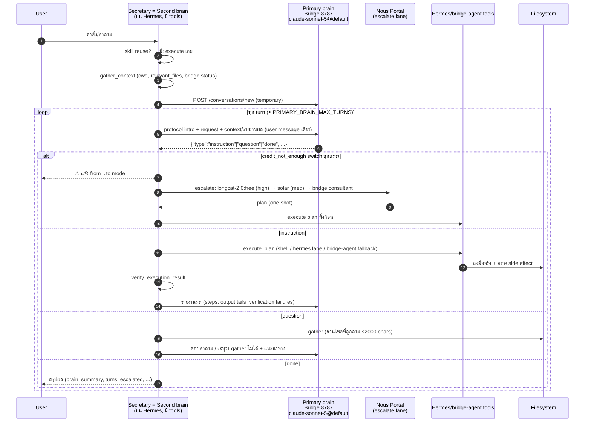

# Primary brain ↔ Second brain — Architecture & Sequence (2026-09-11)

บทบาทตามข้อกำหนดล่าสุด: **AIPASS Bridge 8787 = Primary brain** (วิเคราะห์/วางแผน —
claude-sonnet-5@default), **Secretary = Second brain** (orchestrator บน Hermes,
execute + จัดการเครื่อง), Nous Portal = fallback planning lane

ข้อจำกัดของ bridge ที่ออกแบบรอบ: endpoint รับเฉพาะ user message สุดท้าย
(`extractUserParts` ใน `bridge/server.mjs`) แต่ server เก็บ conversation history เอง
→ ต่อ workflow ต้องเปิด conversation ใหม่ (`POST /conversations/new`) แล้วส่งทีละ
ข้อความ; protocol ทั้งหมด serialize ใน user message

## Sequence (Mermaid)



## พฤติกรรมที่ตรวจสอบแล้ว (2026-09-11)

- Primary mode = default (`SECRETARY_ORCHESTRATION=legacy` เพื่อกลับพฤติกรรมเดิม)
- ที่เครดิต 0: turn แรกตรวจเจอ `data-model_switched` → แจ้ง user → escalate ไป Nous
  (longcat high) → plan → hermes lane (tool-less หลัง switch) → bridge-agent fallback
  เขียนไฟล์จริง → verify ผ่าน → `orchestration:"primary", brain_switched:true, escalated:true`
- Legacy mode ยังทำงานครบ (`orchestration:"legacy"`)
- Unit tests: `test_primary_brain.py` 12/12 (parser, turn bound, session, switch detect)

## Protocol ของ Primary brain

```json
{"type":"instruction","analysis":"...","steps":[{"step":1,"action":"...","command_hint":"optional","expected_outcome":"checkable","is_file_operation":true}]}
{"type":"question","questions":["..."]}
{"type":"done","summary":"..."}
```

Primary ไม่เรียก tools เอง — ทุกการกระทำจริงผ่าน Secretary (second brain) เสมอ

## Fallback ladder (ปรับได้ด้วย env)

1. Skill reuse (ไม่ใช้ brain)
2. Primary brain loop (bridge claude-sonnet-5@default)
3. เจอ switch (credit_not_enough) → Nous longcat-2.0:free (high) → solar-pro4:free (med) → bridge consultant one-shot
4. Bridge ล่ม/turn budget หมด → legacy `run_secrets_workflow` ทั้งก้อน (`orchestration:"legacy_fallback"`)

หมายเหตุ: เมื่อโควตา AiPASS กลับมา > 0, claude-sonnet-5 ตอบจริงโดยไม่มี switch event
→ Primary brain loop ทำงานเต็มรูปแบบ (dialogue ได้หลาย turn) โดยไม่ต้องแก้โค้ด
