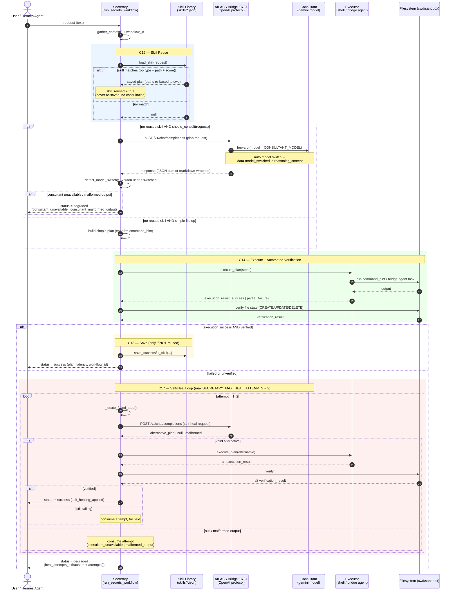
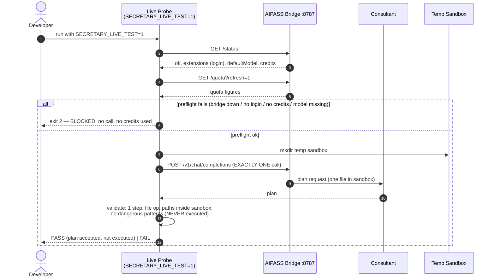
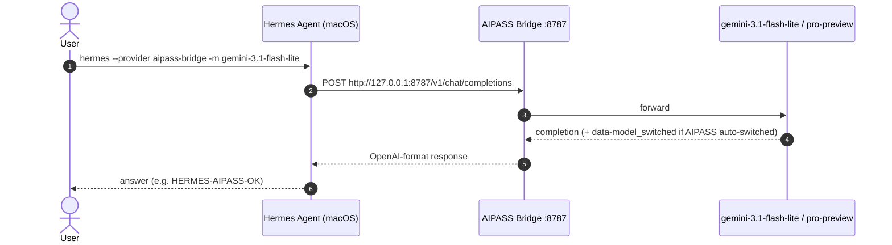

# Secretary — Sequence Diagrams

## 1. Main workflow (`run_secrets_workflow`)

End-to-end flow: Hermes/User request → skill reuse → consultant → execution →
verification → skill save → self-heal loop → success or structured degradation.

## 2. C10–C11 live probe (`test_c10_c11_live_probe.py`, opt-in)

## 3. Hermes Agent integration (macOS)

